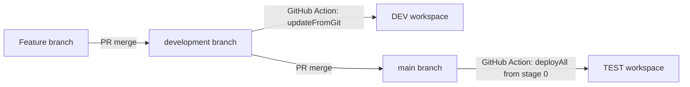

# Power BI CI/CD: DEV to TEST

This guide documents the working two-environment **Path C hybrid** setup in this repository: Fabric Git integration keeps the DEV workspace in sync with Git, and a Power BI deployment pipeline promotes the current DEV workspace to TEST.

It is written for the repository as currently configured. In particular, the sync branch is named `development`, and the promotion workflow is triggered by `main`. There is no PROD stage in this setup.

## 1. How the flow works



- **Git is the source of truth for DEV.** A merged commit on `development` starts `sync-dev.yml`, which asks Fabric to update the Git-connected DEV workspace.
- **The DEV workspace is the source for TEST promotion.** A push to `main` starts `promote.yml`, which asks the deployment pipeline to copy all supported items from stage 0 (Development) to the next stage (Test).
- The GitHub branch `main` triggers promotion; the promotion API does not deploy files from `main`. It deploys the current DEV workspace state.
- TEST must not also be Git-connected in this hybrid process. Use the deployment pipeline as the write path to TEST.

## 2. Repository files

The PBIP project is at the repository root:

- `ActorReportPass.pbip`
- `ActorReportPass.Report/`
- `ActorReportPass.SemanticModel/`

The automation and one-time configuration helper are:

- [DEV sync workflow](.github/workflows/sync-dev.yml)
- [DEV-to-TEST promotion workflow](.github/workflows/promote.yml)
- [Configure Fabric Git credentials script](.github/scripts/configure-fabric-github-credentials.ps1)

Keep the PBIP report and semantic model files committed to the repository. Changes to those files are what the DEV workspace pulls from Git.

## 3. Prerequisites

### Power BI / Fabric

1. **Assign capacity:** Path C requires the DEV and TEST workspaces to be on a supported Premium, PPU, or Fabric capacity.
2. **Connect DEV to GitHub:** In Power BI/Fabric Service, open the DEV workspace, then **Workspace settings > Git integration**. Connect it to this repository and the `development` branch. Use a GitHub PAT or GitHub App authorized for this repository. The TEST workspace should not be Git-connected.
3. **Create the pipeline:** In Power BI Service, open **Deployment pipelines**, create a pipeline with exactly two stages, and assign:
   - Development (stage order `0`) to the DEV workspace.
   - Test (stage order `1`) to the TEST workspace.
4. **Configure deployment rules:** In the pipeline, configure any Test-stage data source or parameter rules needed by the model.
5. **Grant workspace access:** Add the service principal (or its security group) to both workspaces. It needs Contributor or higher; this implementation used Admin.
6. **Grant pipeline access separately:** Open the pipeline's **Manage access** panel and grant the service principal pipeline access. Workspace Admin does not automatically grant pipeline access.
7. **Enable tenant settings:** A Fabric administrator should open **Admin portal > Tenant settings > Developer settings** and enable the relevant service-principal settings for the service principal's security group:
   - Service principals can use Fabric/Power BI APIs.
   - Service principals can create connections, if the setup script must create a Fabric GitHub connection.

### GitHub repository settings

Open the repository's **Settings > Environments** and create two GitHub Environments, named exactly `dev` and `test`.

For each environment, add this **environment secret**:

- Name: `AZURE_CREDENTIALS`
- Value: service-principal JSON with these property names:

```json
{
  "clientId": "<service-principal-client-id>",
  "clientSecret": "<service-principal-secret>",
  "tenantId": "<tenant-id>"
}
```

Do not put real values in this document, workflow YAML, or a commit. The workflow expects one JSON secret, not three separate secrets named `TENANT_ID`, `CLIENT_ID`, and `CLIENT_SECRET`.

Add these **environment variables**:

- In `dev`: `WORKSPACE_ID` = the DEV workspace GUID.
- In `test`: `PIPELINE_ID` = the deployment pipeline GUID. You can copy it from the pipeline's browser URL or retrieve it from the Power BI REST API.

The workflow job declares `environment: dev` or `environment: test`, which is how GitHub makes the matching environment secrets and variables available to the job.

## 4. Configure the service principal's GitHub credentials in Fabric

The GitHub PAT used by a human to connect the DEV workspace is not automatically available to a service principal. The API returned `GitCredentialsNotConfigured` until the service principal had its own configured Fabric Git connection.

Run this setup once from **VS Code**:

1. Open this repository as the VS Code workspace.
2. Select **Terminal > New Terminal** and choose PowerShell.
3. From the repository root, run:

```powershell
.\.github\scripts\configure-fabric-github-credentials.ps1
```

4. Answer each prompt when it appears. Enter only the requested value:
   - Entra tenant ID.
   - Service principal client ID.
   - DEV workspace ID.
   - Entra client secret (input is hidden).
   - If the script finds no GitHub source-control connection, a fine-grained GitHub PAT for this repository (input is hidden).
5. The script gets a Fabric API token, lists GitHub connections available to the service principal, and creates a repository-scoped `ShareableCloud` connection if none is available.
6. It assigns the connection to the service principal's DEV workspace Git credentials with source `ConfiguredConnection`, then reads the setting back to verify it.

The expected final output includes `Verified Git credential source: ConfiguredConnection` and a connection ID. Do not paste the script into the terminal as one block of commands: that can send code fragments to `Read-Host` prompts instead of running the script. If PowerShell blocks execution, in that terminal only run `Set-ExecutionPolicy -Scope Process -ExecutionPolicy Bypass`, then run the script again.

The PAT must have access to this repository. If Fabric returns an access error while creating or listing a connection, check the tenant setting above and confirm the service principal is allowed to use the connection. The service principal also needs Contributor or higher on DEV.

## 5. What the workflows do

### `sync-dev.yml`

**Trigger:** push to `development`.

**Environment:** `dev`.

**Sequence:**

1. Reads `AZURE_CREDENTIALS`, validates its JSON fields, and requests a client-credentials token for `https://api.fabric.microsoft.com/.default`.
2. Calls the DEV workspace's Fabric Git `status` endpoint to get `remoteCommitHash` and `workspaceHead`.
3. Calls `updateFromGit` with those hashes and `options.allowOverrideItems: true`.

Fabric requires the commit hashes in the update request; an empty `{}` body is not sufficient. Fabric also requires explicit consent to override incoming items, so the workflow includes `allowOverrideItems: true`.

**Important overwrite behavior:** this setting authorizes Git-side content to overwrite the corresponding items in DEV. Treat Git as the source of truth for DEV. Commit or back up any workspace-only edits before syncing.

### `promote.yml`

**Trigger:** push to `main`, or manual **workflow_dispatch**.

**Environment:** `test`.

**Sequence:**

1. Reads the `AZURE_CREDENTIALS` secret and requests a client-credentials token for `https://analysis.windows.net/powerbi/api/.default`.
2. Calls Power BI's `deployAll` endpoint for the pipeline with `sourceStageOrder: 0`.
3. Allows creation and overwrite of items in the target stage using `options.allowCreateArtifact: true` and `options.allowOverwriteArtifact: true`.

The deployment targets the stage after the source stage, which is Test in this two-stage pipeline. The create option is needed when Test is empty. The overwrite option allows subsequent Dev changes to replace existing Test items. Stage `0` means Development; verify the pipeline has Dev at order `0` and Test at order `1` before using this workflow.

The workflow currently listens to `main`, not a `test` branch. If you want merges to `test` to trigger this same Dev-to-Test promotion instead, change the branch under `on.push.branches` in `promote.yml` and keep the change consistent with your Git branching process.

## 6. Run a change through DEV and TEST

### A. Make and sync a DEV change

1. In VS Code, open a terminal at the repository root and create a feature branch from `development`:

```powershell
git switch development
git pull
git switch -c demo-change
```

2. Edit a small, visible item in the PBIP project. For example, change a report title in `ActorReportPass.Report/` or a model description in `ActorReportPass.SemanticModel/`.
3. Commit and push the feature branch:

```powershell
git add -A
git commit -m "Demo: update report"
git push -u origin demo-change
```

4. In GitHub, open a pull request with base `development` and compare `demo-change`. Review and merge it.
5. Open the repository's **Actions** tab. The push to `development` should start **Sync Dev workspace from Git**.
6. Wait for the run to finish. Confirm the report/model change appears in the DEV workspace and check **Workspace settings > Git integration** for the last-synced commit.

### B. Promote DEV to TEST

1. Open a pull request with base `main` and compare `development`, then merge it. This push to `main` starts **Promote Dev to Test**. Alternatively, open **Actions > Promote Dev to Test > Run workflow** to run the promotion manually from `main`.
2. Open the run and inspect **Get access token** and **Trigger deployment**. The deployment API can return `202 Accepted`; that means the operation was accepted for processing, not necessarily that it has finished.
3. In Power BI Service, open the deployment pipeline and check the Test stage's deployment time and item status.
4. Open the TEST workspace and verify that the report and semantic model reflect the DEV version.

The Test workspace is deliberately not updated by merging files to a `test` branch. In this design, the pipeline promotes the current DEV workspace.

## 7. Troubleshooting: issues found during setup

| Error or symptom | Cause | Resolution |
|---|---|---|
| GitHub logs show `secrets.TENANT_ID`, `CLIENT_ID`, and `CLIENT_SECRET` as `null`. | The environment had one `AZURE_CREDENTIALS` JSON secret, while the workflow expected three separate secrets. | Use `secrets.AZURE_CREDENTIALS`; the workflows now parse `tenantId`, `clientId`, and `clientSecret` from it. |
| `AADSTS7000216` or an invalid tenant error during local setup. | Code was pasted while PowerShell was waiting for a `Read-Host` answer, so a code fragment was used as the tenant/client ID. | Run the `.ps1` script as a file and answer one prompt at a time. Do not paste code into a prompt. |
| Fabric Git status returns `GitCredentialsNotConfigured`. | The service principal's GitHub provider credentials are separate from the human's workspace Git connection. | Run the configuration script to create/find a GitHub Fabric connection and set `myGitCredentials` to `ConfiguredConnection` for DEV. |
| `updateFromGit` returns `400` with `OverrideItemsNotAllowed`. | The API request did not include consent to overwrite incoming workspace items. | Include `options.allowOverrideItems: true`; understand that Git content can then overwrite matching DEV items. |
| Promotion returns `400 Alm_InvalidRequest_NoArtifactsToDeploy`. | `/deploy` is the selective-deploy endpoint, but the workflow did not provide item IDs. | Use `/deployAll` to deploy all supported items from the source stage. For an empty Test workspace, allow artifact creation. |
| A `202 Accepted` appears but the workspace has not changed yet. | Fabric and Power BI operations can be asynchronous. | Wait for the operation to complete and verify in the workspace/pipeline UI. The current workflows do not poll the operation status. |
| The sync or promotion workflow does not start. | The workflow only runs for its configured branch. | Sync listens to `development`; promotion listens to `main` and also supports manual dispatch. Confirm the PR's base branch and the workflow's `on.push.branches`. |

For an API failure, use the HTTP status and response `errorCode` from the failed step. Remove access tokens, client secrets, PATs, and credential JSON before sharing logs.

## 8. Security and operational notes

- A client secret was exposed in a setup screenshot during testing. Revoke it in Entra ID, create a replacement, and update `AZURE_CREDENTIALS` in both GitHub Environments. Do not reuse an exposed secret.
- Never commit the Entra secret, GitHub PAT, access tokens, or credential JSON. Workflow logs should mask tokens; still inspect logs before sharing them.
- Keep `dev` and `test` GitHub Environment secrets/variables scoped to their corresponding jobs. Do not place `PIPELINE_ID` or `WORKSPACE_ID` in secret or source-code fields unless there is a reason to protect them.
- The deployment workflow has create/overwrite permissions because the initial Test workspace was empty and later needs updates. Review Test-stage rules and preserve any Test-only changes before promotion.
- `updateFromGit` is asynchronous. A successful HTTP response means Fabric accepted the operation. This repository's workflow does not yet poll its long-running operation to completion; use the UI checks above as the final validation.
- This is a two-stage DEV/TEST implementation. There is no production stage or approval gate configured by this guide.

## 9. Microsoft references

- [Fabric Git integration automation](https://learn.microsoft.com/en-us/fabric/cicd/git-integration/git-automation)
- [Fabric Git update from Git API](https://learn.microsoft.com/en-us/rest/api/fabric/core/git/update-from-git)
- [Fabric Git update my Git credentials API](https://learn.microsoft.com/en-us/rest/api/fabric/core/git/update-my-git-credentials)
- [Power BI deployment pipelines: deploy all](https://learn.microsoft.com/en-us/rest/api/power-bi/pipelines/deploy-all)
- [Power BI deployment pipelines: get stages](https://learn.microsoft.com/en-us/rest/api/power-bi/pipelines/get-pipeline-stages)
- [Power BI deployment pipelines: get stage artifacts](https://learn.microsoft.com/en-us/rest/api/power-bi/pipelines/get-pipeline-stage-artifacts)
